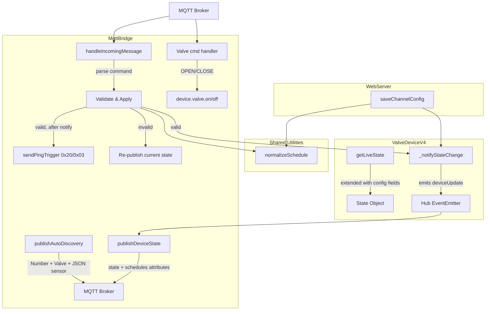

# Design Document: MQTT Channel Config Exposure

## Overview

This feature extends the existing MQTT bridge to expose per-channel valve configuration (default duration, misting parameters, schedules), a native HA valve entity per channel, and device-level diagnostics (firmware, RSSI, water consumption) as Home Assistant entities via MQTT discovery. Currently this data is only accessible through the web UI's Socket.IO interface. The design reuses existing data structures and patterns from `mqttBridge.js` and `webServer.js`.

**Key Design Decisions:**
1. Reuse the existing `diivoo/{valveId}/state` topic by extending `getLiveState()` — avoids separate state topics per config field.
2. Extract `_normalizeSchedule()` to a shared utility module (`core/channelConfig.js`) imported at the top of `mqttBridge.js` so both the web server and MQTT bridge use identical validation.
3. Schedules get a dedicated `json_attributes_topic` because their nested structure doesn't fit a simple sensor state value.
4. Command handlers follow the same pattern as the existing rain delay handler: parse → validate → mutate → notify → ping.
5. Invalid config commands re-publish the current device state (and schedules attributes where applicable) so the HA UI snaps back to actual values.
6. The new valve entity (`device_class: water`) uses a SEPARATE command topic (`diivoo/{valveId}/valve/{ch}/cmd`) from the existing switch entity (`diivoo/{valveId}/valve/{ch}/set`). Both entities coexist independently.
7. After a valid config mutation, `_notifyStateChange()` fires first (which triggers `publishDeviceState` via the hub event), then the config-refresh ping is sent. This ordering ensures the hub state is committed before the valve pulls config.

## Architecture



### Data Flow

1. **State Publishing Flow:** `ValveDeviceV4.getLiveState()` → includes config fields → `MqttBridge.publishDeviceState()` → publishes to `diivoo/{valveId}/state` (JSON) + `diivoo/{valveId}/ch/{ch}/schedules/attributes` (JSON).

2. **Command Flow (valid):** MQTT command received → `handleIncomingMessage()` → validate payload → mutate `channel.settings` or `channel.schedules` → call `device._notifyStateChange()` (triggers `publishDeviceState` via hub event) → call `device.sendPingTrigger(null, 2, 0x03)` (AFTER state notification completes).

3. **Command Flow (invalid):** MQTT command received → `handleIncomingMessage()` → validation fails → log warning → call `this.publishDeviceState({ valveId, state: device.getLiveState() })` to re-publish current state → return. For schedule commands, also call `this.publishScheduleAttributes(device)`.

4. **Valve Command Flow:** `diivoo/{valveId}/valve/{ch}/cmd` received → parse `OPEN`/`CLOSE`/JSON → `OPEN` without duration uses `channel.settings.durationSeconds` → `OPEN` with duration uses specified value (clamped 1–65535) → calls `device.valve(channelId).on(seconds)` or `.off()`.

5. **Discovery Flow:** On MQTT connect/reconnect, `publishAutoDiscovery()` emits retained discovery messages for all entities per device per channel.

### MQTT Topic Structure

| Topic | Direction | Purpose |
|-------|-----------|---------|
| `diivoo/{valveId}/state` | Publish (retained) | Full device state JSON including config fields |
| `diivoo/{valveId}/ch/{ch}/schedules/attributes` | Publish (retained) | Schedules JSON attributes for Lovelace cards |
| `diivoo/{valveId}/ch/{ch}/default_duration/set` | Subscribe | Set default watering duration (seconds) |
| `diivoo/{valveId}/ch/{ch}/mist_on/set` | Subscribe | Set misting on-time (seconds) |
| `diivoo/{valveId}/ch/{ch}/mist_off/set` | Subscribe | Set misting off-interval (seconds) |
| `diivoo/{valveId}/ch/{ch}/schedules/set` | Subscribe | Replace all schedules (JSON array) |
| `diivoo/{valveId}/valve/{ch}/set` | Subscribe | Existing switch on/off (unchanged) |
| `diivoo/{valveId}/valve/{ch}/cmd` | Subscribe | Valve open/close commands (with optional duration) |

> **Note:** The switch entity uses `.../valve/{ch}/set` and the valve entity uses `.../valve/{ch}/cmd`. These are intentionally different topics so both entities function independently.

## Components and Interfaces

### 1. Shared Utility Module: `core/channelConfig.js` (NEW)

Extracts `_normalizeSchedule()` from `webServer.js` into a reusable module so both interfaces share identical validation logic. This module is imported at the top of `mqttBridge.js` (module-level require) for clarity and consistency with the rest of the codebase.

```javascript
// core/channelConfig.js
const { normalizeSchedule, countTotalSchedules } = require('./channelConfig');

/**
 * Normalize a schedule object to canonical form.
 * @param {object} schedule - Raw schedule input
 * @returns {object} Normalized schedule with validated fields
 * @throws {Error} If custom repeat has no weekdays selected
 */
function normalizeSchedule(schedule) {
    const mode = schedule.mode === 'mist' ? 'mist' : 'normal';
    const startTime = typeof schedule.startTime === 'string'
        && /^\d{2}:\d{2}$/.test(schedule.startTime)
        ? schedule.startTime : '06:00';

    const durationMinutes = Math.max(1, Math.min(1092,
        Number(schedule.durationMinutes) || 10));
    const repeat = ['daily', 'odd', 'even', 'custom'].includes(schedule.repeat)
        ? schedule.repeat : 'daily';

    let weekdays = [];
    if (repeat === 'custom') {
        weekdays = Array.isArray(schedule.weekdays)
            ? Array.from(new Set(
                schedule.weekdays.map(Number)
                    .filter(day => day >= 1 && day <= 7)
              )).sort((a, b) => a - b)
            : [];
        if (weekdays.length === 0) {
            throw new Error('At least one weekday required for custom repeat.');
        }
    }

    const normalized = {
        id: schedule.id || `plan-${Date.now()}`,
        mode, startTime, durationMinutes, repeat, weekdays,
    };

    if (mode === 'mist') {
        normalized.mistOnSeconds = Math.max(1, Math.min(3600,
            Number(schedule.mistOnSeconds) || 10));
        normalized.mistOffSeconds = Math.max(1, Math.min(3600,
            Number(schedule.mistOffSeconds) || 30));
    }
    return normalized;
}

/**
 * Count total schedules across all channels of a device.
 * @param {object} channels - Device channels object
 * @param {number} excludeChannelId - Channel to exclude (being replaced)
 * @returns {number}
 */
function countTotalSchedules(channels, excludeChannelId = null) {
    let total = 0;
    for (const [chId, ch] of Object.entries(channels)) {
        if (Number(chId) === excludeChannelId) continue;
        total += Array.isArray(ch.schedules) ? ch.schedules.length : 0;
    }
    return total;
}

module.exports = { normalizeSchedule, countTotalSchedules };
```

### 2. ValveDeviceV4 Extension: `getLiveState()`

Extend the existing method to include channel config and device-level diagnostics.

```javascript
// In ValveDeviceV4.js — getLiveState() additions per channel:
liveChannels[i] = {
    // ... existing fields (status, isRunning, remainingLive, targetRuntime, source, etc.) ...

    // NEW: channel config fields
    defaultOpenSeconds: ch.settings?.durationSeconds || 600,
    intervalOnSeconds: ch.settings?.intervalOnSeconds || 10,
    intervalOffSeconds: ch.settings?.intervalOffSeconds || 30,
    scheduleCount: Array.isArray(ch.schedules) ? ch.schedules.length : 0,

    // NEW: last event data
    lastWaterConsumption: ch.lastWaterConsumption || 0,
    lastElapsedSeconds: ch.lastElapsedSeconds || 0,
    lastEventDate: ch.lastEventDate || null,
};

// NEW: device-level fields in return object:
return {
    // ... existing fields (valveId, model, alias, battery, isOnline, gateways, etc.) ...
    firmwareVersion: this.firmwareVersion != null
        ? `v${this.firmwareVersion}` : 'unknown',
    hardwareRevision: this.hardwareRevision != null
        ? String(this.hardwareRevision) : 'unknown',
    bestRssi: this._computeBestRssi(),
    channels: liveChannels,
};
```

```javascript
// New helper method on ValveDeviceV4:
_computeBestRssi() {
    let best = -100;
    for (const stats of this.gatewayStats.values()) {
        if (stats.rssi > best) best = stats.rssi;
    }
    return best;
}
```

### 3. MqttBridge: Discovery Messages

New entities added to `publishAutoDiscovery()`:

```javascript
// Per-channel entities (inside the channelCount loop):

// Default Duration (Number Entity)
this._publish(
    `${discoveryPrefix}/number/${valveId}_ch${ch}_default_duration/config`,
    JSON.stringify({
        name: t(this.strings, 'valve_default_duration', { ch }),
        unique_id: `diivoo_${valveId}_default_duration_${ch}`,
        state_topic: stateTopic,
        value_template: `{{ value_json.channels['${ch}'].defaultOpenSeconds }}`,
        command_topic: `diivoo/${valveId}/ch/${ch}/default_duration/set`,
        min: 1,
        max: 65535,
        step: 1,
        unit_of_measurement: 's',
        icon: 'mdi:timer-outline',
        entity_category: 'config',
        device: deviceBase
    })
);

// Misting On-Time (Number Entity)
this._publish(
    `${discoveryPrefix}/number/${valveId}_ch${ch}_mist_on/config`,
    JSON.stringify({
        name: t(this.strings, 'valve_mist_on', { ch }),
        unique_id: `diivoo_${valveId}_mist_on_${ch}`,
        state_topic: stateTopic,
        value_template: `{{ value_json.channels['${ch}'].intervalOnSeconds }}`,
        command_topic: `diivoo/${valveId}/ch/${ch}/mist_on/set`,
        min: 1,
        max: 3600,
        step: 1,
        unit_of_measurement: 's',
        icon: 'mdi:spray',
        entity_category: 'config',
        device: deviceBase
    })
);

// Misting Off-Interval (Number Entity)
this._publish(
    `${discoveryPrefix}/number/${valveId}_ch${ch}_mist_off/config`,
    JSON.stringify({
        name: t(this.strings, 'valve_mist_off', { ch }),
        unique_id: `diivoo_${valveId}_mist_off_${ch}`,
        state_topic: stateTopic,
        value_template: `{{ value_json.channels['${ch}'].intervalOffSeconds }}`,
        command_topic: `diivoo/${valveId}/ch/${ch}/mist_off/set`,
        min: 1,
        max: 3600,
        step: 1,
        unit_of_measurement: 's',
        icon: 'mdi:spray',
        entity_category: 'config',
        device: deviceBase
    })
);

// Schedules (JSON Sensor)
this._publish(
    `${discoveryPrefix}/sensor/${valveId}_ch${ch}_schedules/config`,
    JSON.stringify({
        name: t(this.strings, 'valve_schedules', { ch }),
        unique_id: `diivoo_${valveId}_schedules_${ch}`,
        state_topic: stateTopic,
        value_template: `{{ value_json.channels['${ch}'].scheduleCount }} schedules`,
        json_attributes_topic: `diivoo/${valveId}/ch/${ch}/schedules/attributes`,
        icon: 'mdi:calendar-clock',
        device: deviceBase
    })
);

// Valve Entity (Water) — per channel
this._publish(
    `${discoveryPrefix}/valve/${valveId}_ch${ch}/config`,
    JSON.stringify({
        name: t(this.strings, 'valve_water', { ch }),
        unique_id: `diivoo_${valveId}_valve_${ch}`,
        device_class: 'water',
        reports_position: false,
        state_topic: stateTopic,
        value_template: `{{ 'open' if value_json.channels['${ch}'].isRunning else 'closed' }}`,
        command_topic: `diivoo/${valveId}/valve/${ch}/cmd`,
        payload_open: 'OPEN',
        payload_close: 'CLOSE',
        icon: 'mdi:water-pump',
        device: deviceBase
    })
);

// Water Consumption (Diagnostic Sensor)
this._publish(
    `${discoveryPrefix}/sensor/${valveId}_ch${ch}_water_consumption/config`,
    JSON.stringify({
        name: t(this.strings, 'valve_water_consumption', { ch }),
        unique_id: `diivoo_${valveId}_water_consumption_${ch}`,
        state_topic: stateTopic,
        value_template: `{{ value_json.channels['${ch}'].lastWaterConsumption }}`,
        device_class: 'water',
        unit_of_measurement: 'mL',
        state_class: 'measurement',
        entity_category: 'diagnostic',
        device: deviceBase
    })
);

// Last Run Duration (Diagnostic Sensor)
this._publish(
    `${discoveryPrefix}/sensor/${valveId}_ch${ch}_last_duration/config`,
    JSON.stringify({
        name: t(this.strings, 'valve_last_duration', { ch }),
        unique_id: `diivoo_${valveId}_last_duration_${ch}`,
        state_topic: stateTopic,
        value_template: `{{ value_json.channels['${ch}'].lastElapsedSeconds }}`,
        device_class: 'duration',
        unit_of_measurement: 's',
        entity_category: 'diagnostic',
        device: deviceBase
    })
);

// Last Event Timestamp (Diagnostic Sensor)
this._publish(
    `${discoveryPrefix}/sensor/${valveId}_ch${ch}_last_event/config`,
    JSON.stringify({
        name: t(this.strings, 'valve_last_event', { ch }),
        unique_id: `diivoo_${valveId}_last_event_${ch}`,
        state_topic: stateTopic,
        value_template: `{{ value_json.channels['${ch}'].lastEventDate }}`,
        device_class: 'timestamp',
        entity_category: 'diagnostic',
        device: deviceBase
    })
);

// Target Runtime (Diagnostic Sensor)
this._publish(
    `${discoveryPrefix}/sensor/${valveId}_ch${ch}_target_runtime/config`,
    JSON.stringify({
        name: t(this.strings, 'valve_target_runtime', { ch }),
        unique_id: `diivoo_${valveId}_target_runtime_${ch}`,
        state_topic: stateTopic,
        value_template: `{{ value_json.channels['${ch}'].targetRuntime }}`,
        device_class: 'duration',
        unit_of_measurement: 's',
        entity_category: 'diagnostic',
        device: deviceBase
    })
);
```

```javascript
// Device-level entities (outside the channel loop):

// Firmware Version (Diagnostic Sensor)
this._publish(
    `${discoveryPrefix}/sensor/${valveId}_firmware/config`,
    JSON.stringify({
        name: t(this.strings, 'valve_firmware'),
        unique_id: `diivoo_${valveId}_firmware`,
        state_topic: stateTopic,
        value_template: '{{ value_json.firmwareVersion }}',
        icon: 'mdi:chip',
        entity_category: 'diagnostic',
        device: deviceBase
    })
);

// Hardware Revision (Diagnostic Sensor)
this._publish(
    `${discoveryPrefix}/sensor/${valveId}_hw_revision/config`,
    JSON.stringify({
        name: t(this.strings, 'valve_hw_revision'),
        unique_id: `diivoo_${valveId}_hw_revision`,
        state_topic: stateTopic,
        value_template: '{{ value_json.hardwareRevision }}',
        icon: 'mdi:information-outline',
        entity_category: 'diagnostic',
        device: deviceBase
    })
);

// RSSI (Diagnostic Sensor)
this._publish(
    `${discoveryPrefix}/sensor/${valveId}_rssi/config`,
    JSON.stringify({
        name: t(this.strings, 'valve_rssi'),
        unique_id: `diivoo_${valveId}_rssi`,
        state_topic: stateTopic,
        value_template: '{{ value_json.bestRssi }}',
        device_class: 'signal_strength',
        unit_of_measurement: 'dBm',
        entity_category: 'diagnostic',
        device: deviceBase
    })
);
```

> **Valve entity `value_template` note:** The Jinja2 template `{{ 'open' if value_json.channels['1'].isRunning else 'closed' }}` outputs the strings `open`/`closed`. HA's MQTT valve integration uses the template output directly as the state string, so this works correctly — HA does not require a raw boolean.

### 4. MqttBridge: Command Handlers

New command handlers added to `handleIncomingMessage()`. The shared utility is imported at module level (top of `mqttBridge.js`):

```javascript
// At the top of mqttBridge.js (module-level imports)
const { normalizeSchedule, countTotalSchedules } = require('../core/channelConfig');
```

#### Default Duration Handler

```javascript
// --------------------------------------------------------
// Channel Config: diivoo/{valveId}/ch/{channelId}/default_duration/set
// --------------------------------------------------------
if (parts.length === 6 && parts[0] === 'diivoo' && parts[2] === 'ch'
    && parts[4] === 'default_duration' && parts[5] === 'set') {
    const valveId = parseInt(parts[1], 10);
    const channelId = parseInt(parts[3], 10);
    const device = this.hub.devices.get(valveId);
    if (!device) return;

    const channel = device.channels?.[channelId];
    if (!channel) return;
    if (!channel.settings) {
        channel.settings = {
            durationSeconds: 600,
            intervalOnSeconds: 10,
            intervalOffSeconds: 30,
            rainDelayDate: null
        };
    }

    const value = Math.round(parseFloat(raw.trim()));
    if (!Number.isFinite(value) || value < 1 || value > 65535) {
        console.warn(`[MQTT] Invalid default_duration: ${raw}`);
        this.publishDeviceState({ valveId, state: device.getLiveState() });
        return;
    }

    channel.settings.durationSeconds = value;
    device._notifyStateChange('default-duration-mqtt');
    device.sendPingTrigger(null, 2, 0x03).catch(err => {
        console.error(
            `[MQTT] Config ping failed for valve ${valveId}: ${err.message}`
        );
    });
    return;
}
```

#### Misting On-Time Handler

```javascript
// --------------------------------------------------------
// Channel Config: diivoo/{valveId}/ch/{channelId}/mist_on/set
// --------------------------------------------------------
if (parts.length === 6 && parts[0] === 'diivoo' && parts[2] === 'ch'
    && parts[4] === 'mist_on' && parts[5] === 'set') {
    const valveId = parseInt(parts[1], 10);
    const channelId = parseInt(parts[3], 10);
    const device = this.hub.devices.get(valveId);
    if (!device) return;

    const channel = device.channels?.[channelId];
    if (!channel) return;
    if (!channel.settings) {
        channel.settings = {
            durationSeconds: 600,
            intervalOnSeconds: 10,
            intervalOffSeconds: 30,
            rainDelayDate: null
        };
    }

    const value = Math.round(parseFloat(raw.trim()));
    if (!Number.isFinite(value) || value < 1 || value > 3600) {
        console.warn(`[MQTT] Invalid mist_on: ${raw}`);
        this.publishDeviceState({ valveId, state: device.getLiveState() });
        return;
    }

    channel.settings.intervalOnSeconds = value;
    device._notifyStateChange('mist-on-mqtt');
    device.sendPingTrigger(null, 2, 0x03).catch(err => {
        console.error(
            `[MQTT] Config ping failed for valve ${valveId}: ${err.message}`
        );
    });
    return;
}
```

#### Misting Off-Interval Handler

```javascript
// --------------------------------------------------------
// Channel Config: diivoo/{valveId}/ch/{channelId}/mist_off/set
// --------------------------------------------------------
// (Identical pattern to mist_on, with field = intervalOffSeconds, max = 3600)
// On invalid: console.warn + this.publishDeviceState({ valveId, state: device.getLiveState() })
```

#### Schedules Handler

```javascript
// --------------------------------------------------------
// Schedules: diivoo/{valveId}/ch/{channelId}/schedules/set
// --------------------------------------------------------
if (parts.length === 6 && parts[0] === 'diivoo' && parts[2] === 'ch'
    && parts[4] === 'schedules' && parts[5] === 'set') {
    const valveId = parseInt(parts[1], 10);
    const channelId = parseInt(parts[3], 10);
    const device = this.hub.devices.get(valveId);
    if (!device) return;

    const channel = device.channels?.[channelId];
    if (!channel) return;

    // Parse JSON
    const parsed = this._safeJsonParse(raw);
    if (!Array.isArray(parsed)) {
        console.warn(`[MQTT] Invalid schedules payload (not array): ${raw}`);
        this.publishDeviceState({ valveId, state: device.getLiveState() });
        this.publishScheduleAttributes(device);
        return;
    }

    // Normalize each schedule
    let normalized;
    try {
        normalized = parsed.map(item => normalizeSchedule(item || {}));
    } catch (err) {
        console.warn(`[MQTT] Schedule normalization error: ${err.message}`);
        this.publishDeviceState({ valveId, state: device.getLiveState() });
        this.publishScheduleAttributes(device);
        return;
    }

    // Check 6-schedule global limit
    const otherCount = countTotalSchedules(device.channels, channelId);
    if (otherCount + normalized.length > 6) {
        console.warn(
            `[MQTT] Schedule limit exceeded: ${otherCount} existing + ` +
            `${normalized.length} new > 6`
        );
        this.publishDeviceState({ valveId, state: device.getLiveState() });
        this.publishScheduleAttributes(device);
        return;
    }

    // Apply
    if (!Array.isArray(channel.schedules)) channel.schedules = [];
    channel.schedules = normalized;

    device._notifyStateChange('schedules-mqtt');
    device.sendPingTrigger(null, 2, 0x03).catch(err => {
        console.error(
            `[MQTT] Config ping failed for valve ${valveId}: ${err.message}`
        );
    });
    return;
}
```

#### Valve Command Handler

```javascript
// --------------------------------------------------------
// Valve Entity: diivoo/{valveId}/valve/{channelId}/cmd
// --------------------------------------------------------
if (parts.length === 5 && parts[0] === 'diivoo' && parts[2] === 'valve' && parts[4] === 'cmd') {
    const valveId = parseInt(parts[1], 10);
    const channelId = parseInt(parts[3], 10);
    const device = this.hub.devices.get(valveId);
    if (!device) return;

    const channel = device.channels?.[channelId];
    if (!channel) return;

    const trimmed = raw.trim();
    const upper = trimmed.toUpperCase();

    try {
        if (upper === 'CLOSE') {
            await device.valve(channelId).off();
            return;
        }

        if (upper === 'OPEN') {
            // Use channel's defaultOpenSeconds
            const duration = channel.settings?.durationSeconds || 600;
            await device.valve(channelId).on(duration);
            return;
        }

        // Try parsing as JSON: {"command": "OPEN", "duration": 300}
        const parsed = this._safeJsonParse(trimmed);
        if (parsed && typeof parsed === 'object') {
            const cmd = String(parsed.command || '').toUpperCase();
            if (cmd === 'OPEN') {
                const dur = Math.max(1, Math.min(65535,
                    Math.round(Number(parsed.duration) || channel.settings?.durationSeconds || 600)
                ));
                await device.valve(channelId).on(dur);
                return;
            }
            if (cmd === 'CLOSE') {
                await device.valve(channelId).off();
                return;
            }
        }

        // Unrecognized payload — silently discard
    } catch (err) {
        console.error(`[MQTT] Valve cmd failed: ${err.message}`);
    }
    return;
}
```

> **Topic disambiguation:** The existing switch handler matches `parts[4] === 'set'` while this valve handler matches `parts[4] === 'cmd'`. They are mutually exclusive in the routing logic.

### 5. MqttBridge: Schedules Attributes Publishing

New method and integration into `publishDeviceState()`:

```javascript
/**
 * Publish schedule attributes for all channels of a device.
 * Called from publishDeviceState() after the main state publish.
 */
publishScheduleAttributes(device) {
    for (let ch = 1; ch <= (device.channelCount || 0); ch++) {
        const channel = device.channels?.[ch];
        const schedules = Array.isArray(channel?.schedules)
            ? channel.schedules : [];

        this._publish(
            `diivoo/${device.valveId}/ch/${ch}/schedules/attributes`,
            JSON.stringify({ schedules }),
            { retain: true }
        );
    }
}

// Updated publishDeviceState():
publishDeviceState(updateData) {
    const valveId = updateData.valveId;
    const device = this.hub.devices.get(valveId);

    this.publishAutoDiscovery(updateData.state);
    this._publish(`diivoo/${valveId}/state`, JSON.stringify(updateData.state));

    // Publish schedule attributes after state
    if (device) {
        this.publishScheduleAttributes(device);
    }
}
```

### 6. MqttBridge: Subscription Changes

Add new topic patterns to the `client.subscribe()` call in the `connect` handler:

```javascript
this.client.subscribe([
    // ... existing subscriptions ...
    'diivoo/+/ch/+/default_duration/set',
    'diivoo/+/ch/+/mist_on/set',
    'diivoo/+/ch/+/mist_off/set',
    'diivoo/+/ch/+/schedules/set',
    'diivoo/+/valve/+/cmd',
]);
```

## Data Models

### Extended `getLiveState()` Output Schema

```json
{
  "valveId": 12345,
  "model": "WT-13W",
  "alias": "Garden",
  "battery": "OK (4 bars)",
  "batteryPercent": 100,
  "isOnline": true,
  "firmwareVersion": "v2",
  "hardwareRevision": "7",
  "bestRssi": -45,
  "gateways": {
    "gw-1": { "lastSeen": 1700000000, "rssi": -45 }
  },
  "channels": {
    "1": {
      "status": "AUS",
      "isRunning": false,
      "remainingLive": 0,
      "targetRuntime": 600,
      "source": "none / OFF",
      "lastSync": "2024-01-01T00:00:00.000Z",
      "rainDelayHours": 0,
      "rainDelayUntil": "Off",
      "defaultOpenSeconds": 600,
      "intervalOnSeconds": 10,
      "intervalOffSeconds": 30,
      "scheduleCount": 2,
      "lastWaterConsumption": 1500,
      "lastElapsedSeconds": 300,
      "lastEventDate": "2024-06-15T08:30:00.000Z"
    }
  }
}
```

### Schedule Object Schema

```json
{
  "id": "plan-1700000000",
  "mode": "normal",
  "startTime": "06:00",
  "durationMinutes": 30,
  "repeat": "daily",
  "weekdays": [],
  "mistOnSeconds": 10,
  "mistOffSeconds": 30
}
```

### Schedules Attributes Topic Payload

```json
{
  "schedules": [
    { "id": "plan-1", "mode": "normal", "startTime": "06:00", "durationMinutes": 30, "repeat": "daily", "weekdays": [] },
    { "id": "plan-2", "mode": "mist", "startTime": "14:00", "durationMinutes": 15, "repeat": "odd", "weekdays": [], "mistOnSeconds": 5, "mistOffSeconds": 20 }
  ]
}
```

## Correctness Properties

*A property is a characteristic or behavior that should hold true across all valid executions of a system — essentially, a formal statement about what the system should do. Properties serve as the bridge between human-readable specifications and machine-verifiable correctness guarantees.*

### Property 1: Valid command updates are applied correctly

*For any* valid numeric payload within the allowed range for a given config field (durationSeconds: 1–65535, intervalOnSeconds: 1–3600, intervalOffSeconds: 1–3600), sending that value to the corresponding command topic SHALL result in the channel's settings reflecting exactly that value.

**Validates: Requirements 1.4, 2.4, 3.4**

### Property 2: Invalid payloads are rejected without mutation and trigger state re-publish

*For any* payload that is not a finite number within the valid range for a config field (non-numeric strings, NaN, Infinity, 0, negative numbers, out-of-range values), sending that payload to a command topic SHALL leave the channel settings unchanged AND trigger a re-publish of the current device state to the state topic.

**Validates: Requirements 1.5, 2.5, 3.5**

### Property 3: Schedule normalization consistency

*For any* schedule object, normalizing it via the shared `normalizeSchedule()` function SHALL produce a canonical result with validated `mode`, `startTime`, `durationMinutes` (clamped to [1, 1092]), `repeat`, and `weekdays` fields. Both the MQTT bridge and web server use this same function.

**Validates: Requirements 5.3, 5.4**

### Property 4: Global schedule limit enforcement

*For any* device with existing schedules distributed across channels, if a schedules/set command would cause the total schedule count across all channels to exceed 6, the command SHALL be rejected, all channel schedules SHALL remain unchanged, and the current device state and schedules attributes SHALL be re-published.

**Validates: Requirements 5.5**

### Property 5: Invalid schedule payloads are rejected and trigger re-publish

*For any* MQTT payload on the schedules/set topic that is not valid JSON or not a JSON array, the command SHALL be discarded, channel schedules SHALL remain unchanged, and the current device state and schedules attributes SHALL be re-published.

**Validates: Requirements 5.6**

### Property 6: getLiveState backward compatibility

*For any* ValveDeviceV4 instance, `getLiveState()` SHALL always include the existing fields (`status`, `isRunning`, `remainingLive`, `targetRuntime`, `source`, `lastSync`, `rainDelayHours`, `rainDelayUntil`) for each channel — adding new fields does not remove or alter existing ones.

**Validates: Requirements 6.3**

### Property 7: bestRssi is maximum across gateways

*For any* set of RSSI values in a device's `gatewayStats` map, the `bestRssi` field in `getLiveState()` SHALL equal the maximum RSSI value (closest to 0). If the map is empty, it SHALL be -100.

**Validates: Requirements 6.5, 14.3**

### Property 8: State notification and refresh ordering after valid command

*For any* valid config command (default_duration, mist_on, mist_off, or schedules/set with a valid payload), the MQTT bridge SHALL call `_notifyStateChange()` first (which triggers `publishDeviceState` via the hub event), then call `sendPingTrigger(null, 2, 0x03)` exactly once after the state notification. This ordering ensures the device pulls config only after state is committed.

**Validates: Requirements 1.6, 1.7, 2.6, 2.7, 3.6, 3.7, 5.7, 5.8**

### Property 9: Discovery messages cover all channels

*For any* ValveDeviceV4 with `channelCount` channels, `publishAutoDiscovery()` SHALL emit discovery configs for exactly `channelCount` instances of each per-channel entity type (default_duration, mist_on, mist_off, schedules, water_consumption, last_duration, last_event, target_runtime, valve).

**Validates: Requirements 1.1, 2.1, 3.1, 4.1, 9.1, 10.1, 11.1, 15.1, 16.1**

### Property 10: Schedule duration clamping invariant

*For any* schedule object with `durationMinutes` outside the range [1, 1092], normalization SHALL clamp the value to [1, 1092] without rejecting the schedule. The resulting `durationMinutes` shall always satisfy `1 <= durationMinutes <= 1092`.

**Validates: Requirements 5.4**

### Property 11: Valve entity uses defaultOpenSeconds when no duration specified

*For any* OPEN command received on `diivoo/{valveId}/valve/{ch}/cmd` without an explicit duration, the valve SHALL open for exactly `channel.settings.durationSeconds` seconds (the current defaultOpenSeconds). If a duration IS specified via JSON, it SHALL be used instead (clamped to 1–65535).

**Validates: Requirements 16.6, 16.7**

### Property 12: Invalid commands trigger state re-publish

*For any* invalid payload received on a config command topic (number out of range, non-numeric, invalid JSON for schedules, non-array for schedules, schedule limit exceeded), the MQTT bridge SHALL re-publish the current device state to the state topic (and the schedules attributes topic for schedule commands). The state payload SHALL reflect the values BEFORE the rejected command — no mutation occurs.

**Validates: Requirements 1.5, 2.5, 3.5, 5.5, 5.6**

## Error Handling

| Error Condition | Behavior |
|-----------------|----------|
| Non-numeric payload on number command topic | Log warning, discard command, re-publish current device state |
| Out-of-range numeric payload (default_duration, mist_on, mist_off) | Log warning, discard command, re-publish current device state |
| Invalid JSON on schedules/set | Log warning, discard command, re-publish current device state + schedule attributes |
| Non-array JSON on schedules/set | Log warning, discard command, re-publish current device state + schedule attributes |
| Schedule normalization fails (e.g., custom repeat with no weekdays) | Log warning, discard entire schedules/set command, re-publish state + schedule attributes |
| Total schedule count would exceed 6 | Log warning, reject command, re-publish state + schedule attributes |
| Invalid OPEN duration on valve/cmd (non-numeric in JSON) | Clamp to valid range using `Math.max(1, Math.min(65535, ...))`, proceed with clamped value |
| Invalid command on valve/cmd (not OPEN/CLOSE/valid JSON) | Silently discard |
| Device not found for valveId | Silently return (consistent with existing handlers) |
| Channel not found for channelId | Silently return (consistent with existing handlers) |
| sendPingTrigger fails | Log error, but do NOT rollback the setting change (fire-and-forget) |
| MQTT broker disconnect during publish | Messages queued by mqtt.js library, republished on reconnect |

## Testing Strategy

### Property-Based Testing

Property-based testing is appropriate for this feature because:
- The command handlers are pure-logic functions (parse → validate → mutate) with clear input/output behavior
- The input space is large (any numeric value, any JSON payload, any schedule structure)
- Universal properties hold across all valid/invalid inputs
- The tests are low-cost (in-memory, no I/O)

**Library:** [fast-check](https://github.com/dubzzz/fast-check) (MIT license, standard PBT library for JavaScript/Node.js)

**Configuration:** Minimum 100 iterations per property test.

**Tag format:** `Feature: mqtt-channel-config-exposure, Property {N}: {description}`

Each correctness property above maps to a single property-based test:
- Property 1 → Generate random valid values per field, apply, assert equality
- Property 2 → Generate random invalid values, apply, assert no mutation + re-publish called
- Property 3 → Generate random schedule-like objects, normalize, assert canonical structure
- Property 4 → Generate random channel/schedule distributions where total > 6, assert rejection + re-publish
- Property 5 → Generate random non-array payloads, assert rejection + re-publish
- Property 6 → Generate random device states, assert all existing fields present after extension
- Property 7 → Generate random RSSI arrays, assert bestRssi = max (or -100 for empty)
- Property 8 → Generate random valid commands, assert notification called before ping
- Property 9 → Generate random channelCounts (1-4), assert correct entity count per type
- Property 10 → Generate random integers, normalize schedule, assert clamped result in [1, 1092]
- Property 11 → Generate random defaultOpenSeconds values, send OPEN without duration, assert valve.on() called with that value; with duration, assert clamped value used
- Property 12 → Generate random invalid payloads for each command type, assert re-publish called with pre-mutation state

### Unit Tests (Example-Based)

Complement PBT with specific examples:
- Discovery message structure for a known 4-channel WT-13W device
- Static field values (min, max, step, unit, icon, entity_category)
- Schedules attributes topic format
- Retain flag on discovery and attributes publishes
- Reconnect triggers re-discovery
- Valve entity discovery uses consistent topic naming (`valve/{valveId}_ch{ch}/config`)
- Valve OPEN/CLOSE/JSON commands with concrete values
- Existing switch entity remains unchanged after adding valve entity

### Integration Tests

- Full round-trip: send MQTT command → verify state topic reflects new value
- Schedule replacement with a real device mock (verify RF ping sent after state notification)
- Reconnection scenario: disconnect + reconnect → verify discovery republished
- Valve entity command → verify device.valve().on()/off() called with correct duration
- Invalid command → verify state re-published with pre-mutation values
